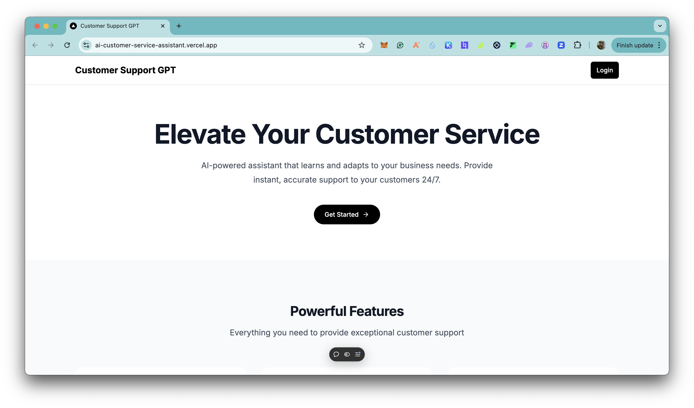
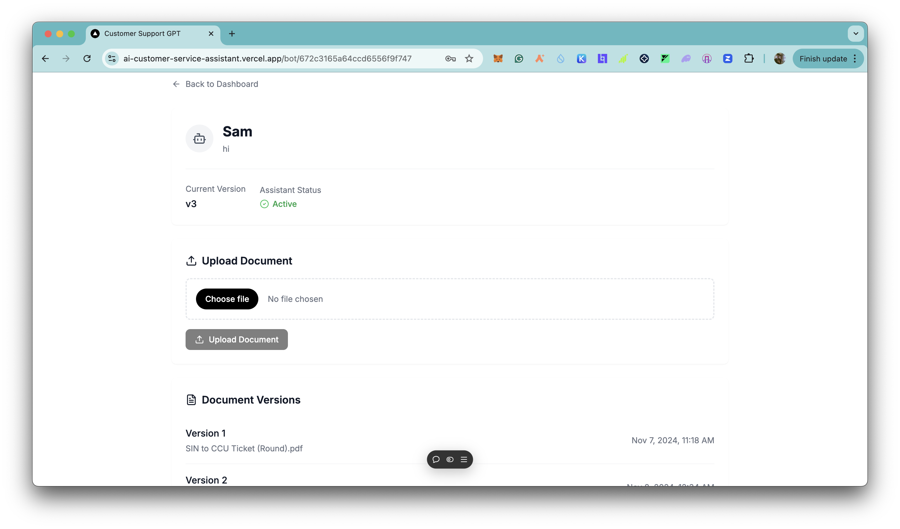
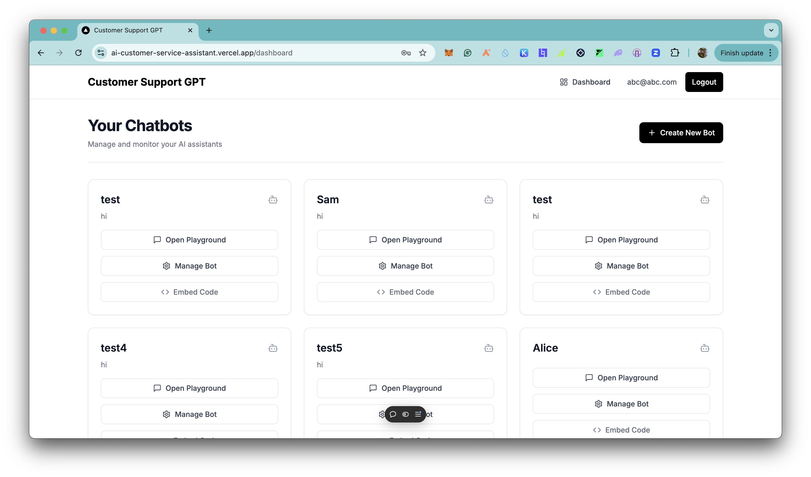
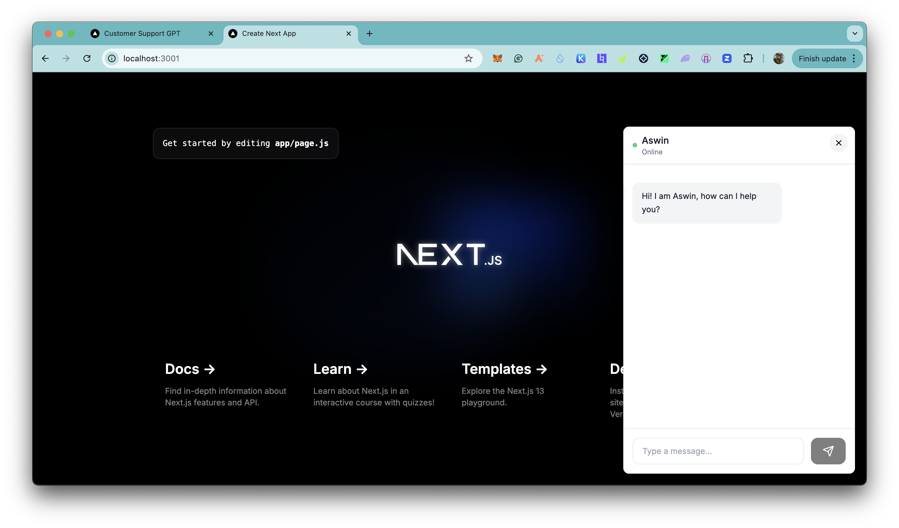

# CustomerSupportGPT
CustomerSupportGPT is an AI-powered customer support assistant that helps businesses provide instant, accurate, and personalized support to their customers 24/7. Whether it's answering FAQs, troubleshooting issues, or guiding customers through complex processes, CustomerSupportGPT is here to assist.

## Table of Contents
  - [Live Demo](#live-demo)
  - [Features](#features)
  - [Technologies Used](#technologies-used)
  - [Getting Started](#getting-started)
    - [Prerequisites](#prerequisites)
    - [Installation](#installation)
  - [Screenshots](#screenshots)
  - [How to use the application](#how-to-use-the-application)
  - [API Reference](#api-reference)
  - [Use Cases & Future Enhancements](#use-cases-and-future-enhancements)
  - [Contributing](#contributing)
  - [License](#license)
  - [Acknowledgments](#acknowledgments)
  - [FAQ](#faq)

## Live Demo

[https://ai-customer-service-assistant.vercel.app/](https://ai-customer-service-assistant.vercel.app/)

## Features

- Secure login and profile management for users and administrators.
- Instant, accurate, and personalized support using OpenAI's GPT-4o model.
- Create and manage multiple bots tailored to different customer support needs.
- Upload documents to create a knowledge base for the AI to reference.
- Engage customers in real-time through a chat interface.

## Technologies Used

- **Next.js:** Full-stack React framework for building modern web applications.
- **OpenAI:** Advanced AI model for natural language understanding and generation.
- **MongoDB:** NoSQL database for storing user data, bot configurations, and chat histories.
- **Jose:** Secure user authentication and authorization.
- **bcryptjs:** Password hashing for enhanced security.
- **lucide-react:** Icon library for React applications.

## Getting Started

### Prerequisites

- Node.js (version 14 or later)
- MongoDB
- OpenAI API key

### Installation

1. Clone the repository:
   ```
   git clone https://github.com/0xmetaschool/customer-support-gpt
   cd customer-support-gpt
   ```

2. Install dependencies:

   ```
   npm install
   ```

   This will install the following key dependencies:
   - next: React framework for production
   - react and react-dom: Core React libraries
   - openai: OpenAI API client for Node.js
   - mongodb: MongoDB driver for Node.js
   - jose: Secure user authentication and authorization.
   - bcryptjs: Library for hashing passwords
   - react-icons: Icon library for React

3. Set up environment variables:
   - Create a `.env.local` file in the root directory
   - Add the following variables:
     ```
     MONGODB_URI=your_mongodb_connection_string
     JWT_SECRET=your_jwt_secret  
     OPENAI_API_KEY=your_openai_api_key
     ENCRYPTION_KEY=your_encryption_key
     ```

4. Start the development server:
   ```
   npm run dev
   ```

5. Open your browser and navigate to `http://localhost:3000`

## Screenshots

<div style="display: flex; justify-content: space-between;">
  
  
</div>

<div style="display: flex; justify-content: space-between;">
  
  
</div>

## How to use the application

1. **Getting Started with CustomerSupportGPT:**
   - Create a new account or sign in to your existing one.
   - Create a new bot and upload documents to create a knowledge base for the AI to reference.
   - Add the embed code to your website to enable the chat support widget.

2. **Maximizing Your Customer Support:**
   - Use the app to create and manage multiple AI-powered bots.
   - Upload documents to create a knowledge base for the AI to reference.
   - Engage customers in real-time through the chat interface.

## Use Cases & Future Enhancements

**Current Use Cases:**
- Instant customer support for FAQs and common issues.
- Troubleshooting and guiding customers through complex processes.
- Personalized support based on customer interactions.
- Real-time chat interface for engaging customers.

**Coming Soon:**
- Real-time voice recognition for customer support.
- AI-powered sentiment analysis for customer feedback.
- Advanced analytics and reporting for continuous improvement.
- Integration with popular CRM systems.

Want to contribute? Check out our contributing guidelines below!

## Contributing

We love contributions! Here's how you can help make the project even better:

- Fork the project (gh repo fork https://github.com/0xmetaschool/customer-support-gpt.git)
- Create your feature branch (git checkout -b feature/AmazingFeature)
- Commit your changes (git commit -m 'Add some AmazingFeature')
- Push to the branch (git push origin feature/AmazingFeature)
- Open a Pull Request

## License

This project is licensed under the MIT License - see the [LICENSE](LICENSE) file for details.

## Acknowledgments

- OpenAI for the GPT-4o API

## FAQ

**Q: Is CustomerSupportGPT free to use?**
A: CustomerSupportGPT is free to use. Basic support features are free, while paywall can be enabled to unlock advanced features.

**Q: How does the AI matching work?**
A: Our AI analyzes customer queries, knowledge base documents, and interaction patterns to provide accurate and personalized support.

**Q: Is my data secure?**
A: Yes, we take data security and privacy very seriously. All user data is encrypted, and we never share your personal information with third parties.